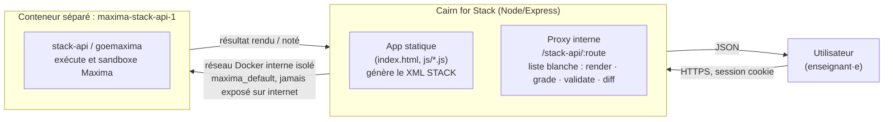

# ⚒️ Cairn for Stack

**Générateur d'exercices STACK avancé pour Moodle.**

Veuillez choisir votre langue pour consulter la documentation / Please select your language to read the documentation:

🇫🇷 **[Français](./README.fr.md)**
🇬🇧 **[English](./README.en.md)**
🇩🇪 **[Deutsch](./README.de.md)**
🇪🇸 **[Español](./README.es.md)**
🇳🇱 **[Nederlands](./README.nl.md)**

## Architecture

Cairn for Stack ne réimplémente jamais Maxima : l'app Node ne fait que produire du
XML STACK et relayer, via une liste blanche de routes, vers le serveur Maxima
officiel (stack-api / goemaxima) qui reste seul responsable de l'exécution et
du sandboxing du code Maxima.

Aucun `exec`/`spawn` de process externe côté Cairn for Stack (vérifié) : toute
exécution de code Maxima a lieu exclusivement dans le conteneur `goemaxima`,
isolé sur son propre réseau Docker et jamais atteignable directement depuis
le navigateur.

## Crédits

Icône de l'application (`assets/icone_48x48.png`) : œuvre d'Adrien Gion.

